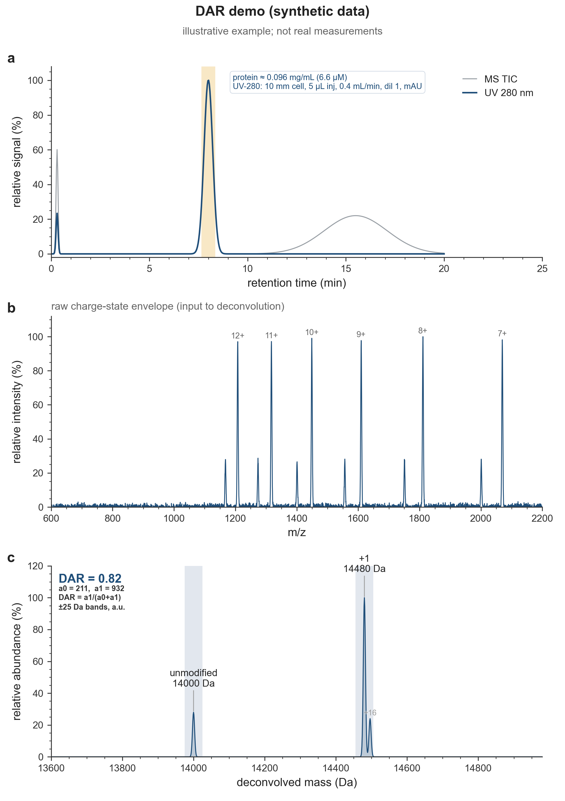

# dar-from-lcms

[](https://github.com/ssiddhantsharma/dar-from-lcms/actions/workflows/ci.yml)
[](https://github.com/ssiddhantsharma/dar-from-lcms/releases/latest)
[](https://github.com/ssiddhantsharma/dar-from-lcms/pkgs/container/dar-from-lcms)
[](LICENSE)

DAR (drug/modifier-to-protein ratio) from intact-mass LC-MS, via UniDec, in one command:

    BASE_MASS=<unmodified avg mass Da> MOD_MASS=<Da added per conjugation> ./dar /path/to/run_dir

Converts vendor raw (Agilent/Bruker `.d`, Thermo/Waters `.raw`, SCIEX `.wiff`, via ProteoWizard) to
mzML, deconvolves each spectrum, and writes the unmodified and +1 masses, the conjugated fraction
and DAR, plus a plot per sample. Written for a single conjugation site (one reactive residue), where
DAR is occupancy 0-1. The deconvolution/DAR works on any mzML; the UV-280 panel is drawn when the
mzML carries a UV/DAD chromatogram (labelled per Agilent's convention, matched loosely for others).

For how the measurement and the scripts work end to end, see [HOW-IT-WORKS.md](HOW-IT-WORKS.md).

## Example output



Synthetic, illustrative data (placeholder masses), regenerate with `python examples/make_demo.py`.

## Setup

    brew install colima docker qemu lima-additional-guestagents   # macOS

The prebuilt UniDec/Wine binaries need a real x86_64 VM (Rosetta breaks Wine); the `dar` script
starts one automatically. On x86_64 Linux, set `COLIMA_CONTEXT=default` and skip Colima.

### Prebuilt image (skip the local build)

`dar` pulls a prebuilt analysis image from GHCR, so you don't wait on the ~10-minute build:

    docker pull ghcr.io/ssiddhantsharma/dar-from-lcms:latest

Pin a version with `DAR_IMAGE=ghcr.io/ssiddhantsharma/dar-from-lcms:v1.0 ./dar ...`. If no image is
available it falls back to building locally from the Dockerfile.

### Faster / cooler on Apple Silicon

The raw-to-mzML conversion needs Wine, which only runs under full x86 emulation (QEMU), and that is
CPU-heavy. The UniDec analysis does not need Wine, so it can run under Rosetta, which is fast and
cool. Turn that on with:

    ANALYZE_CONTEXT=colima-rosetta BASE_MASS=... MOD_MASS=... ./dar ~/Downloads/run

Conversion still uses the QEMU VM (once per file); everything after runs under Rosetta, and
re-analysing already-converted mzML never starts QEMU at all. Stop idle VMs with `colima stop x86`
and `colima stop rosetta`.

## Use

You must give the two masses that define the chemistry:

- `BASE_MASS` -- the unmodified protein's average mass (from its sequence).
- `MOD_MASS`  -- the mass added per conjugation (from the reagent; a thiol-maleimide adds the
  full reagent mass, since it is a Michael addition with no leaving group).

```
BASE_MASS=14000 MOD_MASS=480 ./dar ~/Downloads/run      # auto-detects the main elution peak
BASE_MASS=14000 MOD_MASS=480 TMIN=8.4 TMAX=8.7 ./dar ~/Downloads/run   # fix the window
```

Writes into the run dir:
- `dar_results.json` -- per sample: DAR, elution window, measured unmodified/conjugate masses,
  DAR across integration windows (robustness), and a UV-280 late-feature check.
- `dar_<sample>.png` (and a vector `.pdf`) -- three panels: UV-280 + MS TIC chromatograms (protein
  window shaded), the raw charge-state envelope, and the deconvolved mass spectrum with the
  unmodified / +1 masses anchored at the expected values, DAR bands shaded, and adducts labelled.

The masses are anchored at `BASE_MASS` and `BASE_MASS+MOD_MASS` (not free peak picking), so DAR is
read at the chemically expected positions. If the unmodified and conjugate species co-elute, UV
cannot separate them -- it confirms identity/purity, not an independent DAR; run an unmodified
control for the orthogonal check.

## Concentration (optional, UV-280)

If the mzML carries a UV/DAD trace, the tool can also quantify the protein by Beer-Lambert from
the main UV-280 peak. The peak **area** is always reported (a relative amount, no inputs needed);
an **absolute** concentration is added when you supply the extinction coefficient, flow rate, and
injection volume as env vars:

```
EPS280=20000 FLOW_ML_MIN=0.4 INJ_UL=5 \
  BASE_MASS=... MOD_MASS=... ./dar ~/Downloads/run
```

| env var | meaning | default |
|---|---|---|
| `EPS280` | molar extinction coeff at 280 nm, M⁻¹cm⁻¹ (from the sequence: 5500·Trp + 1490·Tyr + 125·SS) | (off) |
| `FLOW_ML_MIN` | LC flow rate, mL/min | (off) |
| `INJ_UL` | injection volume, µL | (off) |
| `PATH_CM` | flow-cell path length, cm | `1.0` (10 mm) |
| `DILUTION` | sample dilution before injection | `1` |
| `MW_DA` | molecular weight for the mg/mL step | `BASE_MASS` |
| `DAD_UNIT` | `mAU` or `AU` | `mAU` |

Reported in `dar_results.json`: `uv280_peak_area` (+ unit) and, when the inputs are given,
`protein_conc_uM` and `protein_conc_mg_ml` with the inputs echoed under `conc_inputs`. When the
absolute inputs are given, the concentration is also annotated on panel (a) of the figure, next to
the UV trace it came from, with the assumptions printed inline.

Formula: `moles = A[AU·min] · F[L/min] / (ε · path)`, then `conc = moles / injection · dilution`,
`mg/mL = molar · MW`.

Two traps worth knowing:
- **Flow rate is usually *not* in the mzML** (Agilent logs only a placeholder value); read it from
  the LC method. Concentration scales linearly with it.
- **`DAD_UNIT` defaults to `mAU`** because Agilent exports milli-AU even when the mzML labels the
  array `absorbance unit`. Sanity check: if a 220 nm channel tops out in the hundreds it is mAU,
  not AU (getting this wrong is a 1000× error). Set `DAD_UNIT=AU` only if your detector really is.

Absolute UV-280 quant assumes one pure, baseline-resolved protein peak (co-eluting species share
the 280 signal) and a linear detector.

## Tests

The analytical core (mzML parsing, band integration, charge assignment, elution-window pick, DAR
math) has unit tests that need only numpy:

```
pip install numpy pytest && pytest
```

CI runs these on every push, plus a full image build and a real deconvolution smoke test.

## Notes

- Deconvolve the elution-peak window, not the whole run, or the protein drowns in background.
- MS-area DAR assumes both species ionize alike; cross-check against UV for QC numbers.
- Common adducts (`+16` oxidation, `+178` His-tag gluconoylation) are not extra conjugation.
- Run an unmodified control to fix the base mass and confirm the mass step.

## Image notes

UniDec ships two prebuilt binaries with conflicting needs: `isogen.so` wants GLIBCXX_3.4.32
(GCC 14) and `unideclinux` wants `libhdf5_serial.so.103` (HDF5 1.10). Ubuntu 24.04 with the
explicit `libhdf5-103-1t64` runtime satisfies both (not `libhdf5-dev`, which pulls HDF5 1.14 /
`.so.310`). Install UniDec from git, not the stale PyPI release. Keep the `pip install` layer
before the `COPY`, and don't `docker builder prune`, or you evict the ~10-min UniDec build.

## Credits and citation

The deconvolution is done by [UniDec](https://github.com/michaelmarty/UniDec), used here under its
license. If you use this tool in a publication, please cite:

> Marty, M. T. et al. *Bayesian Deconvolution of Mass and Ion Mobility Spectra.*
> Anal. Chem. 2015, 87 (8), 4370-4376. doi:[10.1021/acs.analchem.5b00140](https://doi.org/10.1021/acs.analchem.5b00140)

Raw-to-mzML conversion uses [ProteoWizard](https://proteowizard.sourceforge.io/) (`msconvert`).
This project is an independent wrapper and is not endorsed by or affiliated with the UniDec authors.

## License

This wrapper's own code is MIT-licensed (see [LICENSE](LICENSE)). UniDec and ProteoWizard are used
under their own licenses (see Credits above); they are not redistributed here.

## Related work

UniDec ships MetaUniDec (batch chromatogram deconvolution) and UPP, the UniDec Processing Pipeline
for biotherapeutic MS. This project is a small, focused companion to those: one command that
auto-picks the protein elution window, computes DAR, and emits a report figure, packaged to run
reproducibly via Docker. It uses UniDec's own auto peak-width detection so the deconvolution adapts
to the instrument's resolution.
